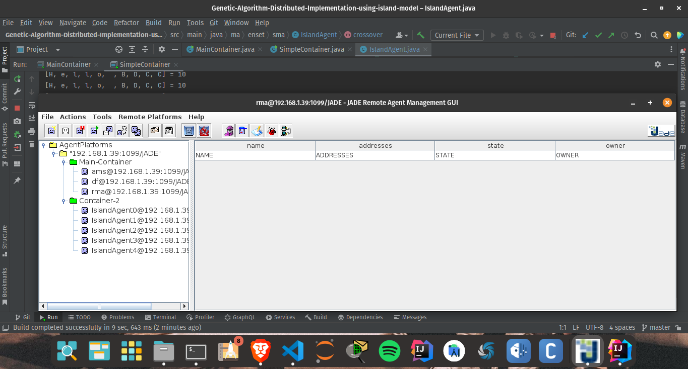
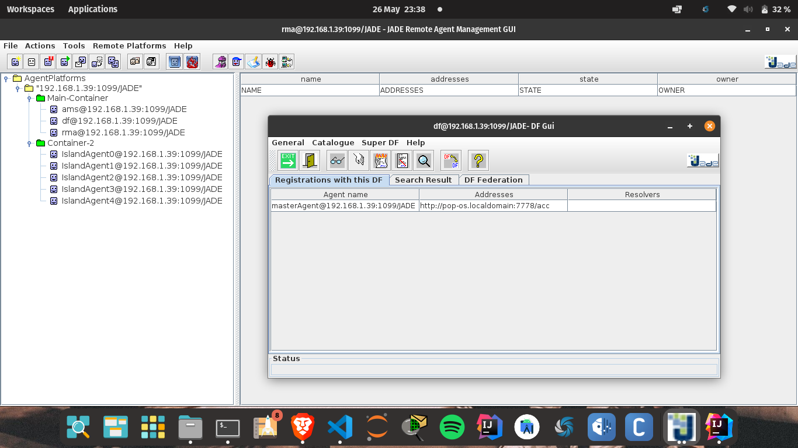

# Genetic Algorithm Distributed Implementation using island model

# Genetic Algorithm Implementation
This repository contains an implementation of a Genetic Algorithm (GA) in Java. The algorithm is designed to solve a specific problem of finding a specific solution string. The repository provides two versions of the algorithm :
1. **Sequential Version**: The `GAApplication` class contains the implementation of the sequential version of the GA. It initializes a population of individuals, performs crossover and mutation operations, and evolves the population over a certain number of iterations until the best fitness is achieved.
2. **Multi-Agent Version**: The `IslandAgent`, `MasterAgent`, and supporting classes implement the multi-agent version of the GA. In this version, multiple island agents operate concurrently, each maintaining its own population and exchanging information with a master agent. The master agent coordinates the communication among the island agents and collects the best solutions.
The implementation uses the concept of chromosomes, fitness evaluation, crossover, mutation, and selection to evolve the population and find the desired solution.

## Prerequisites
- Java Development Kit (JDK)
- JADE (Java Agent DEvelopment Framework)

## Usage
1. Clone the repository :
  ```bash
  $ git clone https://github.com/khawla-dev/Genetic-Algorithm-Distributed-Implementation-using-island-model.git
  ```

2. Compile the Java code :
  ```bash
  $ cd your-repo
  $ javac -cp jade.jar ma/enset/seq/*.java ma/enset/sma/*.java
  ```
  
3. Start the JADE main container :
  ```bash
  $ java -cp your-path-to-jade.jar jade.Boot -gui
  ```
  
4. Run the multi-agent version :
  ```bash
  $ java -cp .:jade.jar ma.enset.sma.MainContainer
  $ java -cp .:jade.jar ma.enset.sma.SimpleContainer
  ```

5. You will see the GUI for the JADE platform. Agents will start executing and exchanging messages.

6. To observe the messages and results, refer to the console output.
    
Feel free to customize the description, instructions, and file paths based on your specific setup and needs. Make sure to replace your-username, your-repo, your-path-to-jade.jar, and any other placeholders with the appropriate values.
Additionally, ensure that the JADE library (jade.jar) is available in the classpath when compiling and running the code.
Note: If you encounter any issues, please refer to the JADE documentation for troubleshooting and further guidance.  

## Screenshots  


